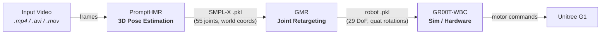

# robotica

Meta-repo for the video-to-robot teleoperation pipeline.

> New to the terminology? See the [Glossary](docs/glossary.md) for beginner-friendly definitions of all technical terms.



## Architecture

```
robotica/
├── setup.sh                 # One-command bootstrap
├── Justfile                 # All CLI recipes
├── .env                     # Sub-repo paths (auto-generated)
├── data/videos/             # Input videos
├── results/                 # Shared pipeline outputs
│   └── <video_name>/
│       ├── phmr_results.pkl     # Stage 1: 3D pose (SMPL-X)
│       └── retarget_*.pkl       # Stage 2: Robot joint angles
├── PromptHMR/               # Stage 1 — 3D human mesh recovery
├── GMR/                     # Stage 2 — Joint retargeting
└── GR00T-WholeBodyControl/  # Stage 3 — Sim & hardware replay
```

## Prerequisites

- Linux with NVIDIA GPU (CUDA 12.6+)
- `git`, `curl`, `bash`
- `gcloud` CLI with access to `gs://io-robotica` (or SMPL-X credentials as fallback — register at https://smpl-x.is.tue.mpg.de)

## Quickstart

```bash
git clone https://github.com/bushuyeu/robotica robotica && cd robotica
bash setup.sh       # clones repos, creates venvs, installs deps
just check           # verify everything is set up
```

## Commands

| Command | Description |
|---------|-------------|
| `just setup` | Run bootstrap script |
| `just check` | Verify envs, models, checkpoints |
| `just quickstart` | Guided first run (Stage 1 + 2 with validation) |
| `just phmr-run <video>` | Extract 3D pose from video |
| `just phmr-batch` | Process all videos in `data/videos/` |
| `just gmr-retarget <video> [robot]` | Retarget to robot (default: `unitree_g1`) |
| `just gmr-batch [robot]` | Batch retarget all processed videos |
| `just pipeline <video> [robot]` | Full Stage 1 + 2 |
| `just pipeline-batch [robot]` | Batch full pipeline |
| `just groot-check` | Verify GR00T Docker image is available |
| `just groot-sim <video>` | Print GR00T Docker instructions |
| `just results` | List all outputs |
| `just drive-check` | Verify rclone + gdrive remote |
| `just drive-list` | List Drive videos and local download status |
| `just drive-sync` | Download new videos from Google Drive |
| `just groot-copy <video>` | Copy retarget .pkl to standalone GR00T repo |
| `just groot-copy-all` | Copy all retarget results to GR00T |
| `just auto-pipeline [robot]` | Full flow: drive-sync + pipeline + groot-copy |
| `just clean` | Delete results (with confirmation) |
| `just monitor-setup` | Set up meta-repo venv (wandb + HF Hub) |
| `just wandb-login` | Authenticate wandb |
| `just hf-login` | Authenticate Hugging Face Hub |
| `just pipeline-monitored <video>` | Single video with wandb logging |
| `just pipeline-monitored-batch` | Batch pipeline with wandb + HF upload |
| `just auto-pipeline-monitored` | Drive sync + pipeline + wandb + HF |

## Data Flow

1. Place videos in `data/videos/`
2. `just phmr-run data/videos/my_video.mp4` — produces `results/my_video/phmr_results.pkl`
3. `just gmr-retarget data/videos/my_video.mp4` — produces `results/my_video/retarget_unitree_g1.pkl`
4. `just groot-sim data/videos/my_video.mp4` — prints Docker commands for simulation

## Documentation

- [Reproduction Guide](docs/reproduction-guide.md) — full walkthrough of the sim pipeline (Stages 1-3)
- [Hardware Deployment Guide](docs/hardware-deployment-guide.md) — deploying on a physical Unitree G1
- [Glossary](docs/glossary.md) — definitions of technical terms

## Notes

- Each sub-repo has its own venv (conflicting PyTorch versions)
- PromptHMR skips processing if results already exist
- GR00T runs inside Docker — `setup.sh` prints instructions but does not install it
- Body models are symlinked from PromptHMR → GMR (no duplication)
